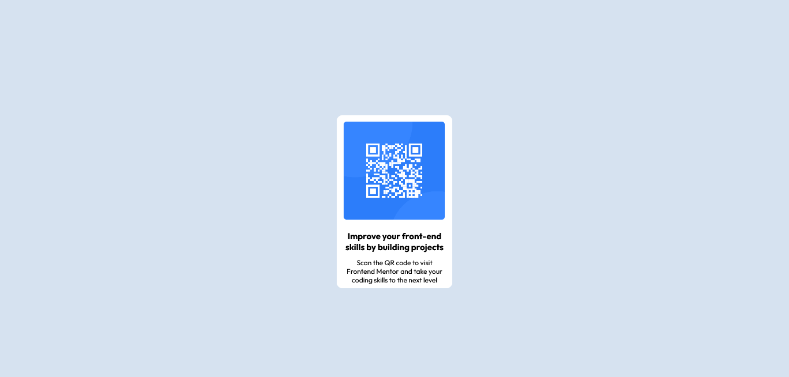

# Qr-Code-frontendmentor
# Frontend Mentor - QR code component solution 

## Table of contents

  - [Overview](#overview)
  - [Screenshot](#screenshot)
  - [Links](#links)
- [Frontend Mentor - QR code component solution](#frontend-mentor---qr-code-component-solution)
  - [Table of contents](#table-of-contents)
  - [Overview](#overview)
    - [Screenshot](#screenshot)
    - [Links](#links)
  - [My process](#my-process)
    - [Built with](#built-with)
    - [What I learned](#what-i-learned)
    - [Continued development](#continued-development)
    - [Useful resources](#useful-resources)
  - [Author](#author)
  - [Acknowledgments](#acknowledgments)


## Overview
This is a solution to the [QR code component challenge on Frontend Mentor](https://www.frontendmentor.io/challenges/qr-code-component-iux_sIO_H).

### Screenshot




### Links

- Solution URL: [solution URL here](https://www.frontendmentor.io/solutions/a-qrcode-using-html-and-css-PuJB6IIVJR)
- Live Site URL: [live site URL here](https://frontqrcode.netlify.app/)

## My process

### Built with

- Semantic HTML5 markup
- CSS custom properties
- Flexbox
- Mobile-first workflow

### What I learned

I learnt the importance of understanding the fundamentals because without them, the simplest of things could give serious headaches. Keeping things simple most of the time is also encouraged  while coding. It is essential that one keeps a cool head while coding and learn to take breaks when neccessary .

I also learnt how to use google fonts.

A code I am proud of:

```css
body{
    overflow-y: hidden;
    background-color: hsl(212, 45%, 89%);
    font-family: 'Outfit', sans-serif;
}
```
### Continued development

I have realized it is important to be consistent. One most always find a way to keep his brain and/or fingers busy in order to always find ways to improve in coding. I'd be needing to brush up my knowledge on media query and use of flex box. Basically improve my knowledge on responsiveness. 


### Useful resources

- [Example resource 1](https://www.W3schools.com) - This helped me in figuring out media queries for mobile and desktop views . I love how concise and direct the website is and will continue to use it going forward.


## Author

- Website - [Owolabi Muktar](https://owolabi-muktar.netlify.app/)
- Frontend Mentor - [@callmemukty](https://www.frontendmentor.io/profile/yourusername)
- Twitter - [@callmemuktar](https://www.twitter.com/callmemuktar)

## Acknowledgments

Mr Folasayo Samuel, for his relentless efforts in wanting me to improve.
